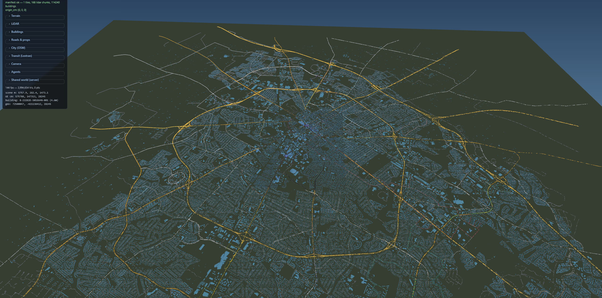
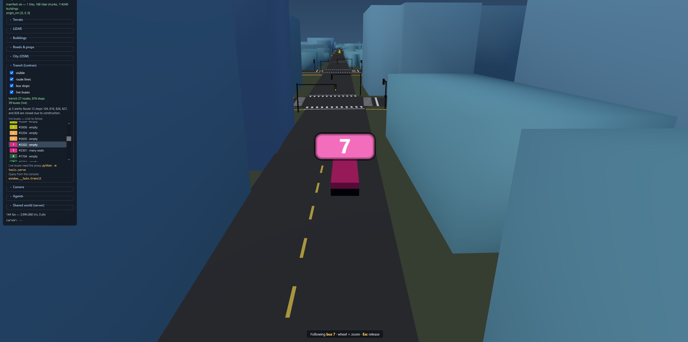
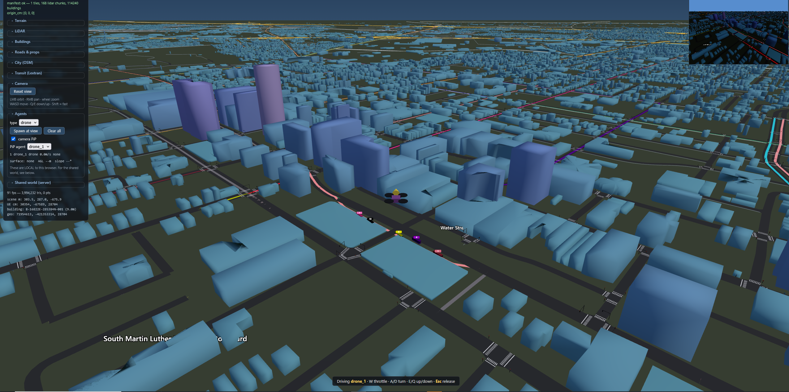

# UKy Campus — Interactive 3D Viewer

Extract UE 4.24.3 UKy Campus LiDAR point cloud + DTM terrain tiles + aerial
imagery into open formats and view them in an interactive Three.js web viewer
— **no Unreal Engine required**. The twin now extends past campus to the full
Lexington / Lextran service area: ~114k OSM building footprints extruded to real
KyFromAbove/KYAPED LiDAR roof heights, the citywide arterial road network with
real LFUCG traffic signals + crosswalks, and the live Lextran bus feed — all in
one draw call at 60 fps.

## Gallery



*The full Lextran service area — ~114k OSM building footprints extruded to real
KYAPED LiDAR roof heights over the city ground plane, with the arterial road
network, rendered in a single draw call at 60 fps.*



*Street level, following a live Route 7 bus — real lane markings, crosswalks, and
signalized intersections derived from the LFUCG traffic-signal data.*



*Downtown — extruded 3D buildings, live traffic signals, street-name labels, and a
first-person agent camera (inset).*

## Quick start

```sh
python -m tools.twin_server     # viewer + LIVE Lextran buses + shared-world API, on :8000
# Open http://localhost:8000/
```

`tools/twin_server.py` is one server that serves the static viewer, proxies the live
Lexington (Lextran) GTFS-Realtime feed so you get **moving buses** on the map, proxies the
city's **live traffic-camera** stream URLs so you can watch real traffic at the
intersections (`/api/cameras/*`), and runs the authoritative shared-world agent API
(`/api/world/*`). Add `--render` for first-person agent cameras, `--mock` to replay a
recorded bus feed offline, `--no-transit` to skip the bus proxy, or `--no-cameras` to skip
the camera proxy. No buses or agents needed at all? Plain `cd web && python -m http.server
8000` still works — routes, stops, and camera markers render; live buses and video just
stay off.

The viewer loads `web/data/manifest.json` and streams terrain tiles + LiDAR
point chunks. All data is pre-extracted — the server just serves static files.

## What's in here

```
CAMPUS/
├── LIDAR/                    # UE4 .uasset source (POINT_CLOUD_2019, 448 MB)
├── MESHES/DTM_GRID/          # UE4 .uasset sources (16 meshes, 18 textures, 17 materials)
├── tools/                    # Python extraction tools
│   ├── uasset.py             # Core UE4 package parser (v518 / 4.24.3)
│   ├── inspect.py            # Export/property dumper
│   ├── extract_texture.py    # Texture2D -> PNG -> JPEG
│   ├── extract_mesh.py       # StaticMesh -> .bin (positions, UVs, indices)
│   ├── extract_lidar.py      # LidarPointCloud -> decimated chunked .bin (campus only)
│   ├── ky_lidar.py           # KyFromAbove/KYAPED LiDAR -> citywide point cloud + ground grid
│   ├── extract_scene.py      # Blueprint scene assembly (transforms, materials)
│   ├── extract_buildings.py  # LiDAR building-class → 3D mesh (legacy, DBSCAN)
│   ├── extract_buildings_hybrid.py  # OSM footprints split LiDAR + give height (campus, UE source)
│   ├── build_city.py         # full-city 3D buildings: OSM footprints + KYAPED roof heights
│   ├── verify_buildings_osm.py      # verify footprints vs OSM ground truth
│   ├── osm_roads.py          # OpenStreetMap → campus road network (roads.json)
│   ├── osm_city.py           # OpenStreetMap → city-wide streets + ground plane (city.json)
│   ├── lextran_gtfs.py       # Lextran static GTFS → routes + stops (transit.json)
│   ├── lex_cameras.py        # city traffic cams → intersection mapping (cameras.json)
│   ├── twin_server.py        # one server: static viewer + shared-world API (/api/world/*)
│   │                         #   + live bus proxy (/api/transit/*) + camera URL proxy (/api/cameras/*)
│   ├── pack_buildings.py     # merge 3,109 building meshes → one buffer (fast load)
│   ├── transit_common.py     # shared lon/lat → scene projection (georef)
│   ├── roadnet.py            # road graph (routing) from roads.json
│   ├── traffic.py            # deterministic signals + NPC vehicles (sim core)
│   ├── verify_gym.py         # gym env test suite (check_env, vectorization, traffic, SPL, …)
│   ├── extract_roads.py      # aerial-texture road detector (alt. road source)
│   ├── fetch_lfucg_signals.py # download LFUCG real traffic-signal locations
│   ├── smooth_roads.py       # smooth roads + signalise junctions → signals.json
│   ├── ground_buildings.py   # drop floating buildings onto the terrain (keep bridges)
│   ├── build_all.py          # Full pipeline orchestrator
│   ├── verify_viewer.py      # Headless viewer test (requires playwright)
│   └── verify_agents.py      # Headless agent-API sensor test (requires playwright)
├── web/                      # Three.js viewer (static)
│   ├── index.html
│   ├── app.js
│   ├── roads.js              # road ribbons + signals/crosswalks + live signal controller
│   ├── city.js               # city-wide OSM ground plane + streets (city.json)
│   ├── transit.js            # live Lextran buses + routes/stops/arrivals/alerts
│   ├── cameras.js            # traffic-camera markers + live HLS picture-in-picture
│   ├── agents.js             # autonomous agents (car/truck/robot/drone) + sensors (local)
│   ├── netagents.js          # renders the twin_server shared world (agents from any client)
│   ├── style.css
│   ├── lib/                  # Vendored Three.js 0.160 + OrbitControls + hls.js 1.6
│   └── data/                 # Generated extraction output
│       ├── manifest.json     # Unified scene manifest
│       ├── meshes/*.bin      # 16 terrain tiles (verts, UVs, indices)
│       ├── textures/*.jpg    # 18 aerial imagery textures
│       ├── lidar/chunk_*.bin # 64 decimated point-cloud chunks
│       ├── buildings/*.bin   # per-building meshes (legacy / fallback)
│       ├── buildings.pack.bin + .json  # all buildings in ONE buffer (fast load)
│       ├── roads.json        # smoothed road centrelines + real intersections
│       ├── signals.json      # machine-readable signal model (autonomous agents)
│       ├── city.json         # city-wide OSM streets + ground plane
│       ├── transit.json      # Lextran routes + stops (live buses via tools/twin_server.py)
│       └── cameras.json      # traffic cam → intersection map (live HLS via tools/twin_server.py)
├── campus_gym/              # Gymnasium (single) + PettingZoo (multi) env over the sim core
├── client/                  # twin.py — dependency-free Python client for the world API
├── examples/                # drone_demo.py + car/truck/robot vision demos (YOLO via the camera feed)
└── extracted/                # Per-domain manifests + reports
```

## Re-extracting from source

All data is already extracted and under `web/data/`. If you need to regenerate:

```sh
pip install pillow numpy
python tools/build_all.py
# Or selectively:
python tools/build_all.py --skip-textures --skip-meshes
```

## Filling in Lexington — KyFromAbove LiDAR

The campus point cloud started as a single UE asset (`POINT_CLOUD_2019`); the rest of
Lexington is filled in from the authoritative statewide **KyFromAbove / KYAPED** LiDAR
(2025, Phase 3), which **supersedes** the campus scan where they overlap. `tools/ky_lidar.py`
queries the tile index, downloads the 5,000-ft `.copc.laz` tiles from S3, reprojects them
from NAD83 Kentucky Single Zone (US ft) into the scene's UTM-16N frame, and writes the
viewer's point chunks plus a citywide bare-ground elevation grid.

```sh
pip install "laspy[lazrs]" pyproj numpy pillow
python -m tools.ky_lidar --list                 # 168 tiles over the city extent
python -m tools.ky_lidar --download-aoi         # fetch every tile to extracted/ (~8 GB, resumable)
python -m tools.ky_lidar --build --heightmap    # -> web/data/lidar/ky_*.bin + ground.f32 + manifest
python -m tools.twin_server                     # serve viewer + world + buses on :8000
```

Then open http://localhost:8000/, expand the **LiDAR** panel, and tick **visible**. Agent
ground-snapping (`tools/twin_server.Ground`) uses the new `ground.f32` grid as the primary
elevation citywide, so cars/buses follow real terrain beyond the campus tiles. Everything
lands under the gitignored `web/data/`; the previous campus manifest is backed up to
`web/data/manifest.campus.bak.json`.

## Full-city buildings + roads

The campus extract (`build_all.py`) needs the UE source assets, but the **rest of the
city is built from open data only** — OpenStreetMap + the KyFromAbove LiDAR — so it
reproduces from a clone without Unreal. Given the scene georef (`web/data/manifest.json`)
plus the downloaded LiDAR and ground grid from the KyFromAbove step above:

```sh
pip install "laspy[lazrs]" pyproj shapely scikit-image numpy
python -m tools.osm_city            # web/data/city.json (service-area bbox + flat ground plane)

# 3-D buildings: OSM footprints extruded to real KYAPED roof heights, flat base on the
# ground plane (~114k buildings over the full Lextran service area)
python -m tools.build_city          # -> web/data/buildings/*.bin + merges the manifest
python -m tools.pack_buildings      # -> buildings.pack.bin/.json (ONE fetch, ONE draw call)

# roads + real traffic signals
python -m tools.osm_roads           # -> roads.json (OSM highways draped on the plane)
python -m tools.smooth_roads        # -> signals.json (gated against the LFUCG signal layer)
```

`tools/build_city.py` fetches OSM footprints (tiled + cached, resumable), streams the
LiDAR one tile at a time so memory stays bounded over the whole city, and sets each
building's height from the **85th-percentile elevation of the non-ground (class 1)
returns inside its footprint** (KYAPED has no building class, so non-ground-over-a-
footprint is the roof) minus the `ground.f32` ground elevation. Buildings sit flat on
the city ground plane (`city.json` `groundY`); the true terrain still shows when the
LiDAR layer is toggled on. Heights land where expected — median ~8 m, up to ~123 m
downtown (Lexington's tallest tower). Tune with `--grid` / `--sample` / `--roof-pct`.

**Performance:** the viewer renders all buildings as one packed buffer / one draw call,
and `roads.js` renders ribbons + signal props with merged + instanced geometry, so the
**full street network city-wide** (~9.6k roads / 2,800 km, ~13M triangles) still holds
**~60 fps** with LiDAR off by default. The cursor read-out intersects the ground plane
analytically (no per-frame mesh raycast), so orbit/pan stays smooth at city scale. Bus
route lines are floated a fixed height above the asphalt and split into lateral lanes,
so coplanar routes never z-fight the road or each other. If you target a low-end GPU,
restricting `osm_roads` to the arterial classes (leaving residential as the lightweight
`city.json` lines) roughly halves the triangle count.

## Viewer controls

| Control | Action |
|---------|--------|
| Left mouse | Orbit |
| Right mouse | Pan |
| Scroll | Zoom |
| WASD | Fly |
| Q / E | Down / Up |
| Shift | 4x speed |

UI panel: layer toggles, terrain opacity, UV V-flip, point cloud budget slider,
wireframe mode, camera reset.

**Flat world (default).** The viewer pins terrain, roads, the city ground plane,
buildings, buses, agents, and camera markers to a single elevation (`web/flat.js`),
so moving vehicles always sit on the road instead of clipping through it at the
campus/city seam (the two elevation systems — campus LiDAR relief and the lower flat
city plane — used to disagree there). The campus relief is intentionally discarded in
this mode; append **`?flat=0`** to the URL to restore the real LiDAR terrain elevation
and per-surface draping.

## Data stats

- 16 terrain tiles (804 m square grid, half-mile spacing)
- 18 ortho imagery textures (4096x4096, ~74 MB total JPEG)
- ~24.9M LiDAR points (decimated to ~12M in 64 chunks, ~183 MB)
- 3,109 building meshes (2,346 OSM-split + LiDAR-shaped, 763 LiDAR-only) from
  ~5.5M building-class LiDAR points + OpenStreetMap footprints (~3.9 MB total).
  Median footprint IoU vs OSM 0.93; verify with `python -m tools.verify_buildings_osm`
- 449 road centrelines (~70 km), smoothed + draped on terrain; 266 real
  intersections, **51 signalised** (gated against the **real LFUCG traffic-signal
  layer**), 112 stop-controlled, 103 uncontrolled — each with traffic + pedestrian
  signals, crosswalks, and stop bars (see `web/README.md`). Regenerate with
  `python -m tools.smooth_roads`.
- All 3,109 buildings dropped onto the terrain (no floaters; 4 road-spanning bridges
  left elevated) — `python -m tools.ground_buildings`.
- Viewport: ~1.8 km x 3.4 km area centered on UKy Lexington campus
- 3,109 buildings packed into ONE buffer (`buildings.pack.bin`, ~3.9 MB): the
  viewer makes 1 request + 1 draw call instead of ~3,100 — all buildings ready in
  ~2 s. Regenerate with `python -m tools.pack_buildings`.
- City context: full Lextran service area (~18 x 16 km) of OpenStreetMap streets
  (8,481 ways) on a flat ground plane, so the whole bus network has streets + ground
  beyond the campus tiles. Regenerate with `python -m tools.osm_city`.
- Transit: 27 Lextran routes + 878 stops (`transit.json`), plus live buses /
  arrivals / alerts via the `tools/twin_server.py` proxy. Regenerate with
  `python -m tools.lextran_gtfs`.

## Digital twin — controllable signals + autonomous agents

The road network is built for autonomous-agent simulation: `tools/smooth_roads.py`
emits `web/data/signals.json`, a machine-readable model of every intersection
(approach legs, stop-line coordinates, crosswalk polygons, signal phase groups, and
a fixed-time phase plan). The viewer ticks a deterministic signal state machine and
exposes it at `window.__twin.signals`, so an agent can ask "what is my light right
now and where do I stop" (`getLegState` / `queryByPosition`) and even drive the
lights (`setOverride`).

On top of that, `web/agents.js` adds **controllable agents** — spawn a car, truck,
robot, or drone at `window.__twin.agents`, drive it from your own code, and read
back a POV **camera**, live **position** (scene m / UE cm / UTM-16N), object
**collision detection** (you program the avoidance), and a **ground/surface** probe
that keeps ground vehicles on the road or terrain and tells you which one they're
on. Full API + schemas for both in [web/README.md](web/README.md); smoke-test the
agent sensors with `python tools/verify_agents.py`.

The twin also carries the **real Lexington bus network**. `tools/twin_server.py` proxies
the live Lextran GTFS-Realtime feed and the viewer animates the actual buses on the
map — with route lines, stops, predicted arrivals, and service alerts — all reachable
at `window.__twin.transit` (`getVehicles` / `getNearestVehicle` / `getArrivals` / …).
Buses are wired into the agent sensor bus too (`sensors.transit`), so an autonomous
agent can yield to or wait for a real campus bus. Because the network spans far past
the campus tiles, `tools/osm_city.py` lays down the rest of Lexington (OSM streets +
a ground plane) so every route has ground beneath it. Smoke-test the live layer with
`python tools/verify_transit.py`.

## Live traffic cameras

The twin also shows **real traffic at the intersections**. The City of Lexington
publishes ~113 live traffic cameras; `tools/lex_cameras.py` projects each camera's
lon/lat through the same UTM-16N → scene georef the rest of the twin uses and snaps it
to the nearest intersection in `signals.json`, baking the mapping into
`web/data/cameras.json` (106 of 113 land within 75 m of an existing twin intersection;
the ~7 outliers are highway interchanges, placed at their own GPS position and flagged).
The viewer (`web/cameras.js`) draws a camera marker on each junction — teal when it sits
on a twin intersection, amber when it doesn't — and lists them all in the **Traffic
cameras** panel.

Click a marker (or a list row) to open that intersection's **real-time video in a
picture-in-picture panel** — just the stream, no detection. The camera feeds are
tokenized HLS URLs the city re-signs every ~15 minutes, so they can't be baked: like
the bus positions, `tools/twin_server.py` re-scrapes fresh URLs on demand and serves
them same-origin (`/api/cameras/streams`); the browser plays them directly with the
vendored `hls.js` (the camera origin sends permissive CORS, so no segment proxying is
needed). With no server running you still get the markers and the token-free snapshot
thumbnail; with it you get live video. Everything is reachable from the console at
`window.__twin.cameras` (`list` / `getNearest` / `streamUrl` / `still`).

Regenerate the mapping (e.g. if the city adds cameras) with `python -m tools.lex_cameras`
(reads TrafficStream's cached `cam_data.json`; pass `--scrape` to pull a fresh list, or
`--cam-data PATH` to point at a specific file). The camera object-detection side
(YOLO vehicle counts) lives in the separate
[TrafficStream](https://github.com/Kentucky-Open-Science/TrafficStream2026) project; the
twin intentionally embeds only the raw stream.

### Camera-detected cars (Phase 1 — geometry + spawn)

Work in progress toward spawning a twin car for each vehicle a camera sees. Each stream
is a 2×2 quad of four independent wide-angle views, so there's no automatic camera→world
mapping; instead you **calibrate** it. Open a camera's PiP, click **Calibrate**, then
click a point in the camera image and the matching spot in the 3D twin (4+ per quad) — the
viewer solves a per-(camera, quad) **homography** (`web/homography.js`, dependency-free,
Hartley-normalized) and reprojects the fit back onto the video to judge. Calibrations are
saved (version-controlled) under `calibration/cameras.json` via the twin server
(`/api/cameras/calib`). Then **Spawn mode**: click the video where a car is and a
**kinematic** car appears in the shared world at the mapped scene point, visible to every
viewer (`netagents.js`). Kinematic agents (`/api/world/.../pose`, `kinematic:true` on
spawn) carry no physics and auto-despawn after `--kinematic-ttl` seconds (default 5)
without a pose update, so a feed that stops cleans up after itself. Spec + plan under
`specs/003-camera-detected-cars/`. Phase 2 adds the server-side YOLO + ByteTrack detector
that drives the spawn loop from real detections.

## Multiplayer twin server — shared world over an API

`window.__twin.agents` is private to one browser tab. For a **shared** world — where
the twin runs on its own server and many scripts/users drive agents that everyone
sees — run the authoritative server:

```sh
python -m tools.twin_server        # viewer + world API + live buses on :8000
```

Run it **as a module from the repo root** (`python -m tools.twin_server`), not
`python tools/twin_server.py` — it imports the `tools` package, and running it as a
loose file breaks that import. One server now does it all on a single port: the viewer,
the world API (`/api/world/*`), the live bus proxy (`/api/transit/*`), and — with
`--render` — first-person agent cameras.

> **`404`/`503` on `/api/world/...`?** Something else is answering on `:8000` — usually a
> plain `python -m http.server` left running, which serves the viewer's files but has no
> world API. Stop it and run `python -m tools.twin_server` instead. To run a second server
> on the same machine, give the twin another port: `python -m tools.twin_server --port 8001`
> and point clients/browser at `:8001`.

It holds every agent in one place, ticks the physics (the same ackermann / differential
/ holonomic-drone kinematics as `agents.js`, with ground from the terrain heightmap and
collisions from the baked building AABBs), and exposes a small REST API. Agents spawned
by ANY client are visible to ALL of them — other scripts and any browser open on the
server (`web/netagents.js` renders the shared world in the **Shared world (server)**
panel section).

Drive it from Python with the dependency-free client (`client/twin.py`):

```python
from twin import Twin
twin  = Twin("http://twin-host:8000", owner="alice")
drone = twin.spawn("drone", position=[0, None, 0])
drone.set_controls(move=[5, 1, 0])          # fly +X and climb
print(drone.state()["position"], drone.collisions())
for other in twin.agents():                 # every agent in the shared world
    print(other["owner"], other["type"], other["position"])
drone.stop(); drone.despawn()
```

The REST surface (all JSON, CORS-open): `GET /api/world/state` (everyone's agents),
`GET /api/world/agents/<id>`, `POST /api/world/spawn`, `POST /api/world/agents/<id>/{controls,driveTo,stop}`,
`DELETE /api/world/agents/<id>`, plus `GET /api/world/{meta,nearest_building}`.

A runnable example — spawn a drone, fly a circuit, fly into a building until the
collision sensor fires, then stop — is in `examples/drone_demo.py`:

```sh
python -m tools.twin_server &                 # the twin
python examples/drone_demo.py --url http://localhost:8000   # a client script
# open http://localhost:8000/ in a browser to watch it in 3-D
```

### First-person cameras + vision navigation (YOLO)

The server can also produce a **first-person video feed** for every agent, so a script
can drive by what the agent *sees* instead of by ground-truth state. The server has no
renderer of its own, so `--render` attaches a headless browser (the viewer) as an
internal render service and serves JPEG frames:

```sh
python -m tools.twin_server --render          # adds /api/world/agents/<id>/camera
```

From a script, `agent.camera_image(w, h)` returns the frame as a PIL image. The
`car` / `truck` / `robot` examples feed it to the **smallest YOLO model** (`yolov8n`)
and steer to avoid what it detects — e.g. it flags the campus traffic-signal heads as
COCO `traffic light` and vehicles in the aerial ground imagery as `car`:

```sh
pip install -r examples/requirements.txt      # ultralytics (smallest YOLO) + torch (CPU ok)
python -m tools.twin_server --render &
python examples/car_demo.py                    # or truck_demo.py / robot_demo.py
# open http://localhost:8000/ to watch them drive themselves
```

All three spawn into the same shared world, so you can run them together (and watch in a
browser) and they'll see and bump into each other. `client/twin.py` exposes the feed as
`agent.camera()` (JPEG bytes) / `agent.camera_image()` (PIL); `examples/yolo_drive.py`
holds the shared camera→YOLO→controls loop.

## Gym environment (`campus_gym`)

For training/evaluation, the simulation core (`tools/twin_server.World`/`Agent`) is
also wrapped as a **synchronous, headless gym environment** — it advances only inside
`step()` (no server, no browser, no real-time clock), so it runs faster than real time
and is reproducible. The real-time REST server stays for interactive/multi-client use;
this is its training-shaped twin.

```python
import gymnasium as gym, campus_gym          # registers Campus-v0, CampusDrone-v0, ...
env = gym.make("Campus-v0")                   # single agent (Gymnasium)
obs, info = env.reset(seed=0)
obs, reward, terminated, truncated, info = env.step(env.action_space.sample())
```

Task (Tier 0): drive a `car`/`truck`/`robot`/`drone` to a seeded goal on campus
without crashing into a building or leaving the map.
- **observation** `Box(13)`: ego kinematics + nearest-building (ego frame) + goal (ego frame)
- **action**: ground `[accel/brake, steer] ∈ [-1,1]`; drone `[vx,vy,vz] ∈ [-1,1]`
- **reward**: progress toward the goal − collision/off-map penalties − small time cost
- **terminated** reached goal / crashed / off map; **truncated** at `max_episode_steps`

Multi-agent is exposed as a **PettingZoo Parallel** env (every agent acts each step;
dict-keyed obs/reward/terminated/truncated/info; agents collide with each other):

```python
from campus_gym import CampusParallelEnv
env = CampusParallelEnv(agent_types=("car", "truck", "drone", "robot"))
obs, infos = env.reset(seed=0)
obs, rewards, terms, truncs, infos = env.step({a: env.action_space(a).sample() for a in env.agents})
```

Read-only world data (terrain heightmap + building AABBs) is loaded once and shared
across env instances, so it **vectorises** (`gymnasium.vector.SyncVectorEnv([...])`).

### Language-conditioned navigation + evaluation (the agentic layer)

`CampusNav-v0` (and `CampusNav{Car,Truck,Robot,Drone}-v0`) turns the twin's **real
named entities** — Lextran bus stops and named campus streets — into goals specified
in **natural language**. Each episode hands the agent an instruction grounded in a real
coordinate, so an LLM/VLM agent reads `info["instruction"]`:

```python
env = gym.make("CampusNav-v0")
obs, info = env.reset(seed=0)
info["instruction"]   # e.g. "drive to the Transit Center" / "navigate to Pennsylvania Avenue"
```

Supporting pieces:
- **Configurable reward** — a sum of named, weighted terms (`CampusEnv(reward_weights=...)`),
  with the per-term breakdown in `info["reward_terms"]` for transparent shaping/ablation.
- **Metrics** (`campus_gym.eval`) — `evaluate(env, policy, episodes)` reports success rate,
  **SPL** (success weighted by path length, using the road-graph shortest route), collision
  rate, and mean return.
- **Record + deterministic replay** (`campus_gym.record`) — log an episode to JSONL
  (seed + actions + per-step reward + the instruction) and replay it exactly.

```sh
python examples/gym_nav_eval.py --type car --episodes 10   # instructions + SPL + replay
```

### NPC traffic + signals, scenarios, vectorization, training

- **Sensable traffic** — `CampusTraffic-v0` / `CampusEnv(npc_traffic=N, signals=True)` adds
  **NPC cars** that drive the real road graph (IDM car-following + red-light stopping) and the
  **deterministic traffic signals** (ported from the viewer into the authoritative `World`), so
  the agent perceives and must yield to them — the observation grows to 18 dims with nearest-
  vehicle + signal-ahead features. (Previously signals/transit lived only in the browser.)
- **Scenarios + domain randomization** (`campus_gym.scenarios`) — a declarative `Scenario`
  spec + registry (`make_scenario("campus_traffic")`), `train_test_seeds()` for held-out
  evaluation, and `domain_random=True` to jitter agent dynamics per reset (sim-to-real).
- **Vectorization** — `SyncVectorEnv` and `AsyncVectorEnv` (use the picklable `campus_gym.make_env`).
- **RL training** — `examples/train_ppo.py` trains Stable-Baselines3 PPO and evaluates it
  on held-out seeds before vs. after (return improves as it learns to drive to goals).

```sh
python examples/train_ppo.py --timesteps 50000 --n-envs 6      # pip install stable-baselines3
```

Verify the whole stack (Gymnasium `check_env`, PettingZoo `parallel_api_test`, seeded
determinism, Sync+Async vectorization, named/language goals, NPC traffic + signals, eval/SPL,
scenarios + domain randomization, record+replay) with `python -m tools.verify_gym`. This
covers Tiers 0-3 of the agentic-gym roadmap end to end. Remaining stretch items: importing
real traffic datasets, richer scenario authoring, and visual (camera) observations for the
trainer (the camera feed exists via the server's `--render`, but the gym defaults to fast
state-vector observations).